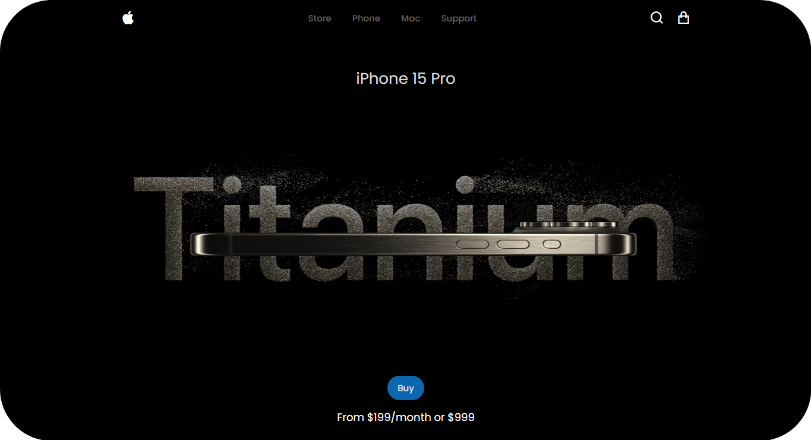

<!-- Main Image — Hero Section -->

  

<!-- Used Technologies -->

  
  
  
  
  
  

<!-- Project Name -->
<h3 align="center">...</h3>
 

<!-- Project Type -->

  

 
 

<!-- Project Overview & Desc.. -->
## 📝&nbsp; About **...**
⇨ ...

◈ `Feature` → ...

◈ `Feature` → ...

◈ `Feature` → ...

 

<!-- Real Showcase-->
## 🎬&nbsp; Demo & Showcase

  
<strong>Desktop</strong>

   

  

  
<strong>Tablet</strong>

   

  

  
<strong>Mobile</strong>

   

  

 

<!-- What Learn from that Project -->
## 🧠&nbsp; What I Learned 

① `Thing` → ...

② `Thing` → ...

③ `Thing` → ...

④ `Thing` → ...
